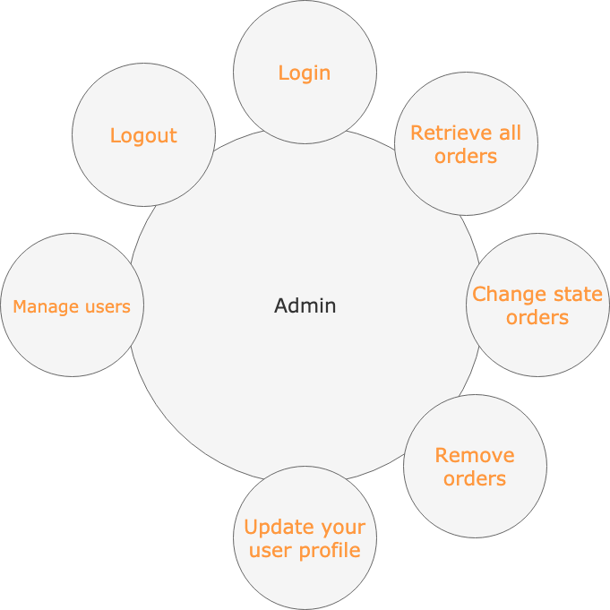
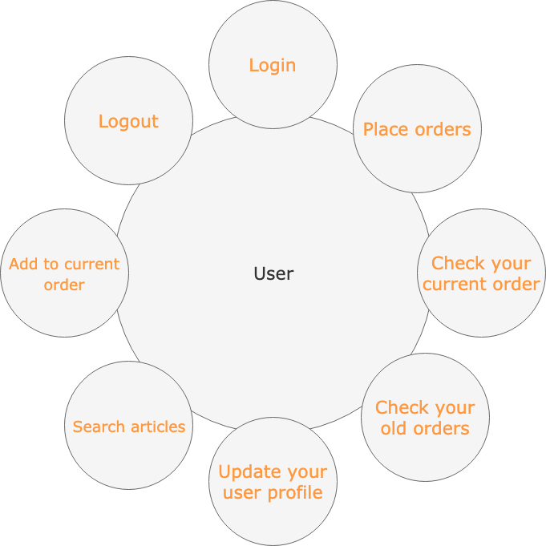
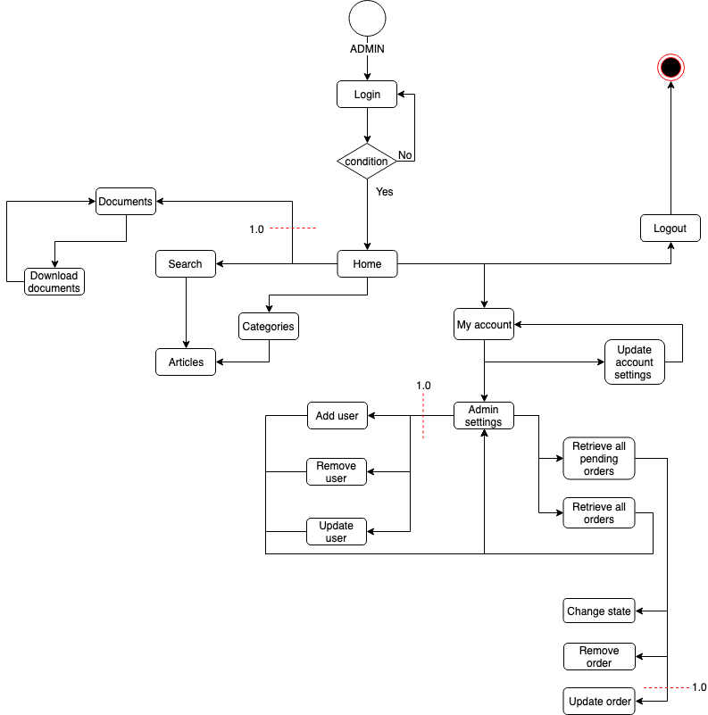
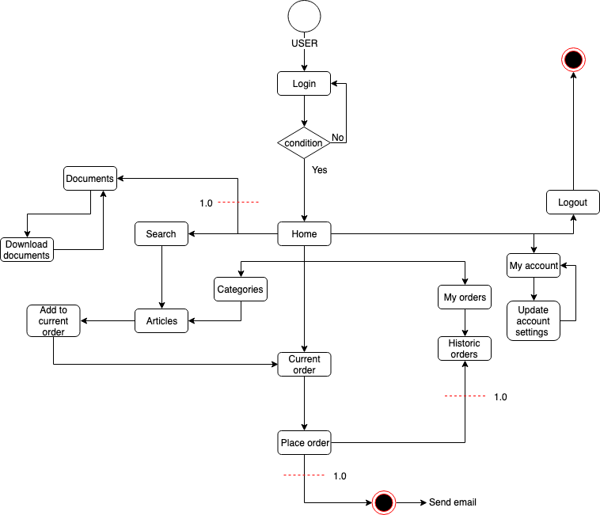
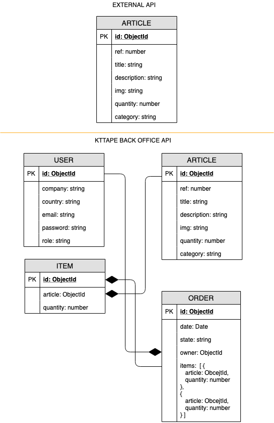
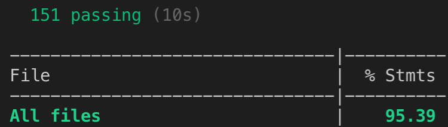

# KtTape Back Office
A project by:
    **Adrià Arquimbau Codina**

---

## **Introduction**
---
KtTape Back Office is a multiple page with React to facilitate online ordering of branded products between national suppliers and the continental supplier.

With this application we want to improve and facilitate the realization of online orders, with an automated stock update system.

## **Functional Description**
---
Admin can:

0.5 (Actual Version)
+ Check the all orders
+ Check pending orders and be able to mark them as made or pending
+ Remove pending orders
+ Update your user profile

1.0 
+ Update orders
+ Add new client account
+ Update client account
+ Remove client account
+ Have access to documentation of interest of the brand.
+ Update new documentation

Users can:

0.5 (Actual Version)
+ Place online orders for each product with real stock.
+ Check your current order 
+ Update your user profile.

1.0
+ Have access to documentation of interest of the brand.
+ Check history orders and place order with a old model.

---

### Use cases

#### Admin

#### User

### Flowscharts

#### Admin

#### User

## **Technical Description**
---

### **Blocks**

### **Components**

<!-- ### **React Components** TODO
 -->

## **Data Model**
---

## **Code Coverage**
---

## **Tecnologies**
---

Javascript, ReactJS, Node.js, Express, MongoDB & Mongoose.

## **TODO**
---
React Testing