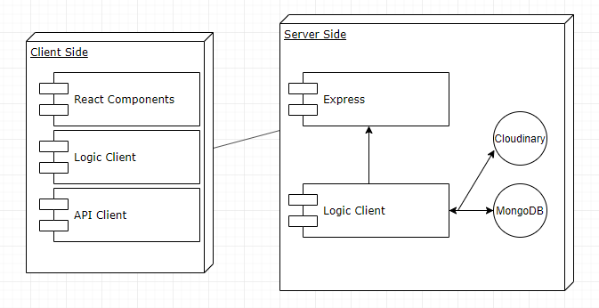

# SKYSHOP

## INTRODUCTION
The following app is an e-commerce app which enables you to search and buy different products from Skylab Coders Acemy.
You can search based on button-search input type or advanced search.

The products can be clicked allowing you to access more details from the article itself.

After registration a user can log in and apart from searching news he can add the product to the cart.

When going to the cart page the user can remove items or go directly to the checkout button in order to execute the payment.

**USE CASES**

**FLOW DIAGRAM**

**BLOCK DIAGRAM**

**COMPONENTS**

**DATA MODEL**

### CODE COVERAGE

