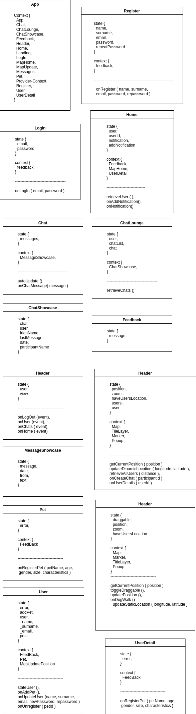

# Dogs & Company

**Anna Nolla Vila @ Skylab Coders Academy**

**Trello Link**
https://trello.com/b/FM2dn4Gu/dog-company

## Introduction

Dogs && Company is a MERN Single Web Application created by Anna Nolla Vila at Skylab Coders Academy.

The SPA uses Open Street Maps API, Leaflet library and MongoDB to geolocate user’s favorite walking areas. It allows to put you in contact with those users and pet walkers.

Dogs && Company let pet lovers to, match, chat into the SPA and socialize with others sharing time with their pets while discover new walking areas and promenades of the city.

## **Functional description**

### Use Case

### Flowchart

## Technical description

### Blocks

### Components

### React Components

### Data Model

