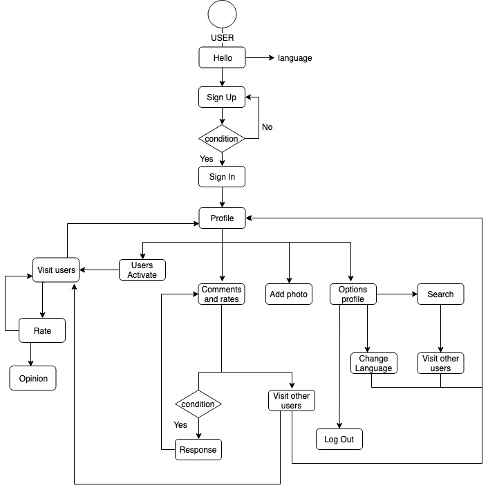
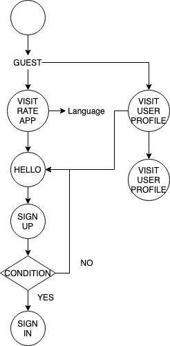

# **RATE** 

## **Introduction**
---

Create an App to rate and write an opinion about the interaction with other user, with the aim to:

Shows the users near to interactuate.

Search other users by username.

Get a profile with your rate an opinions.

## **Functional description**
---
User can:

- Create a profile with a photo and username. Contains an average with rates and opinions that provide other users. 
- User can search other users by username.
- User can see other members in a radius of 50 meters.
- User can rate and write an opinion of other users, only once a day.
- In first 24h since the rate of other user, is allowed write a response.

- Only registered user can rate.

## **Use case**

## **Flowcharts**
#### **User**

#### **Guest**

## **Tecnical Description**
#### **Blocks**

#### **Components**

#### **React Components**
#### **Data Model**

#### **Code Coverage**

## **Technologies**
---
Javascript, ReactJS, Node.js, Express, MongoDB & Mongoose.

