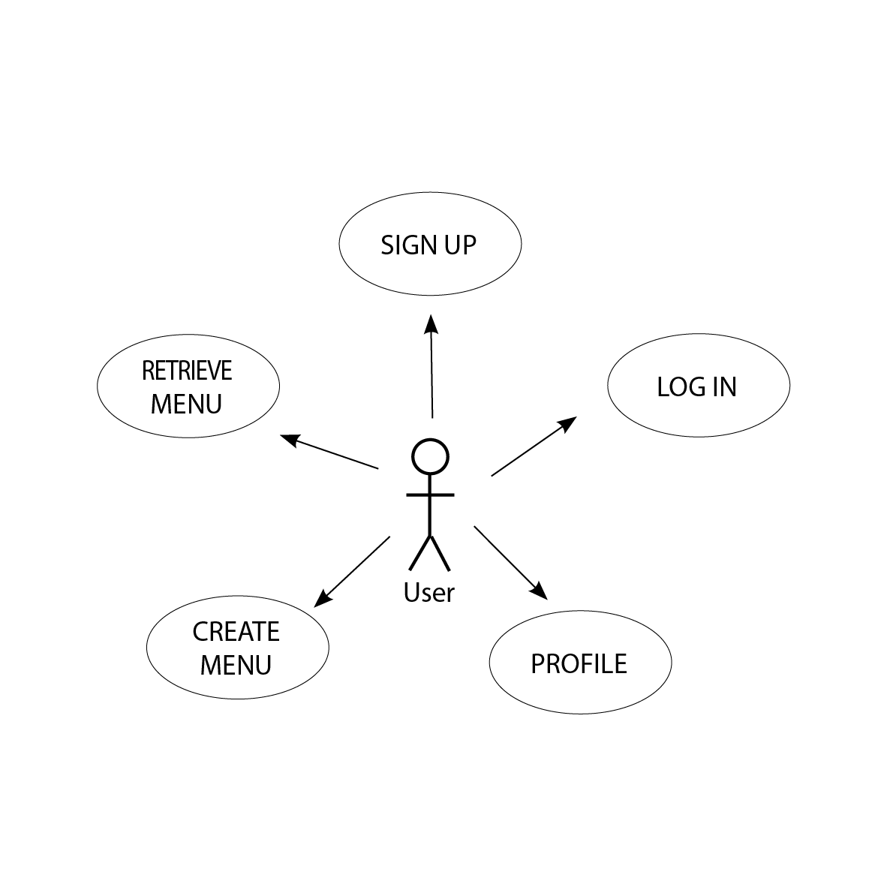
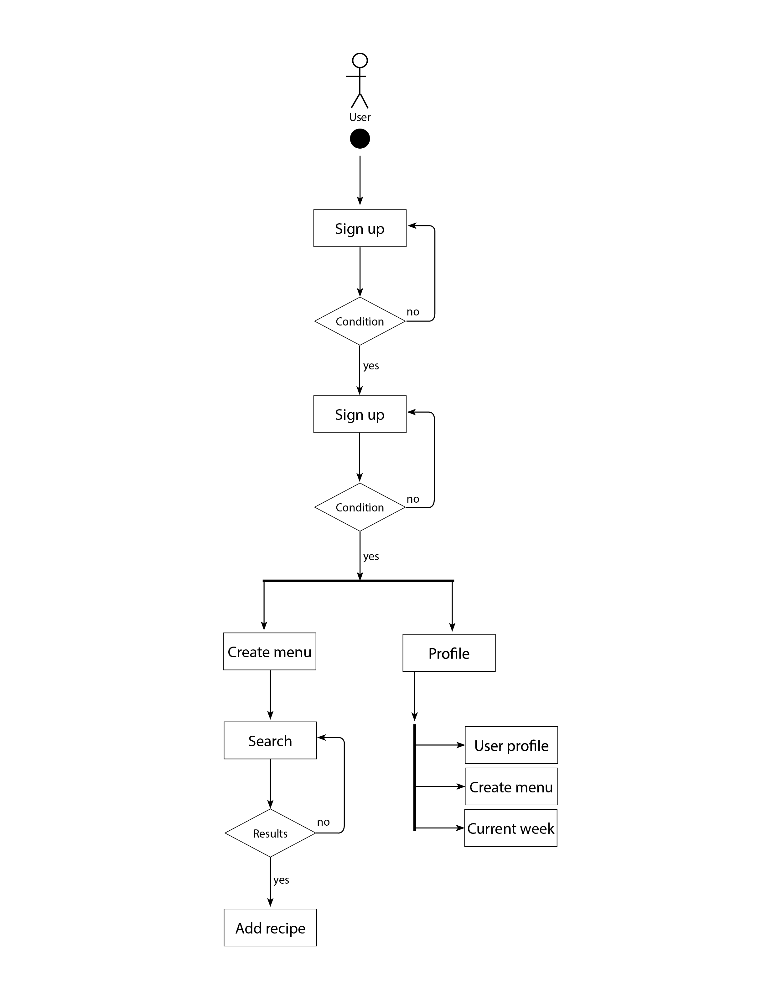
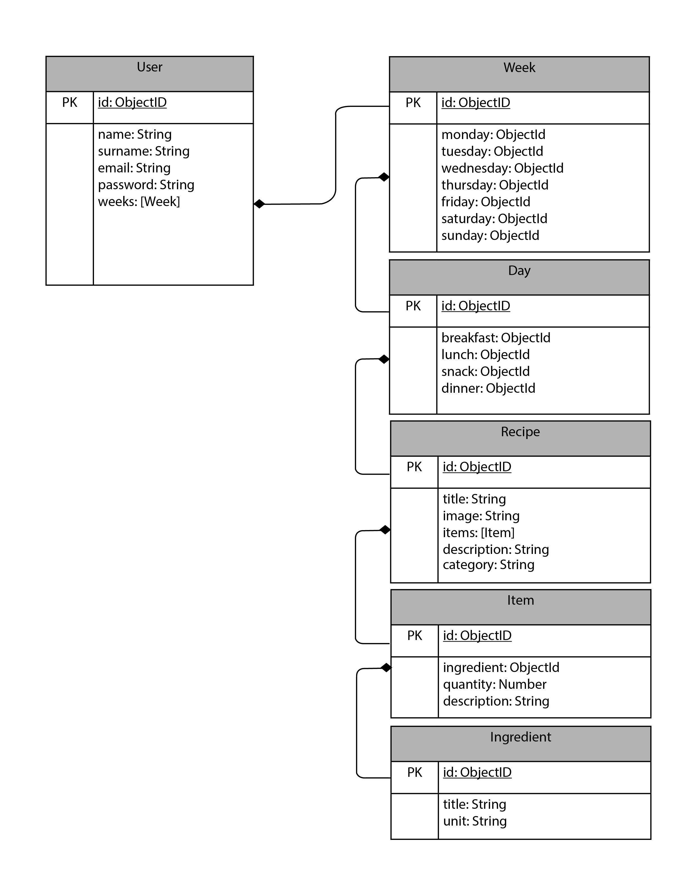
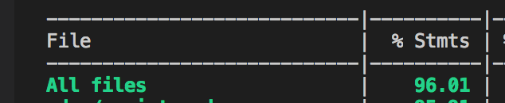
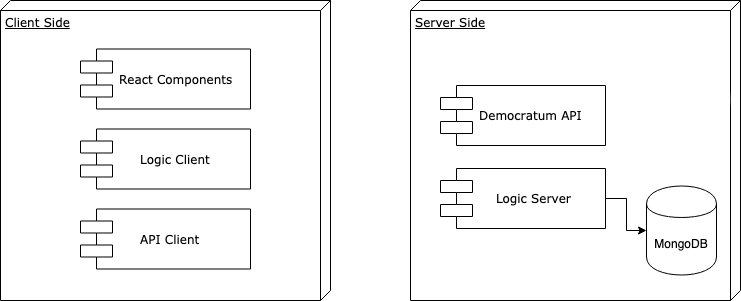

# MENU PLANNER

## INTRODUCTION
The following app is a menu planner application which enables you to create a week menu planner.

This project has been developed with REACT and the layout website has been done with SASS.

### FUNCTIONAL DESCRIPTION

Users can:

· Create their own four meals daily menu plan.
· Consult their week menu plan.
· Consult all recipes details.
· Retrieve their user profile.

**USE CASES**

**FLOW DIAGRAM**

**BLOCK DIAGRAM**

**COMPONENTS**

**DATA MODEL**

### CODE COVERAGE

### TECHNOLOGIES

Javascript, ReactJS, Node.js, Express, MongoDB & Mongoose.

### TODO

· Weekly checklist.

· Consult by food categories.

· Add personal recipes.

· Favorites recipes.

