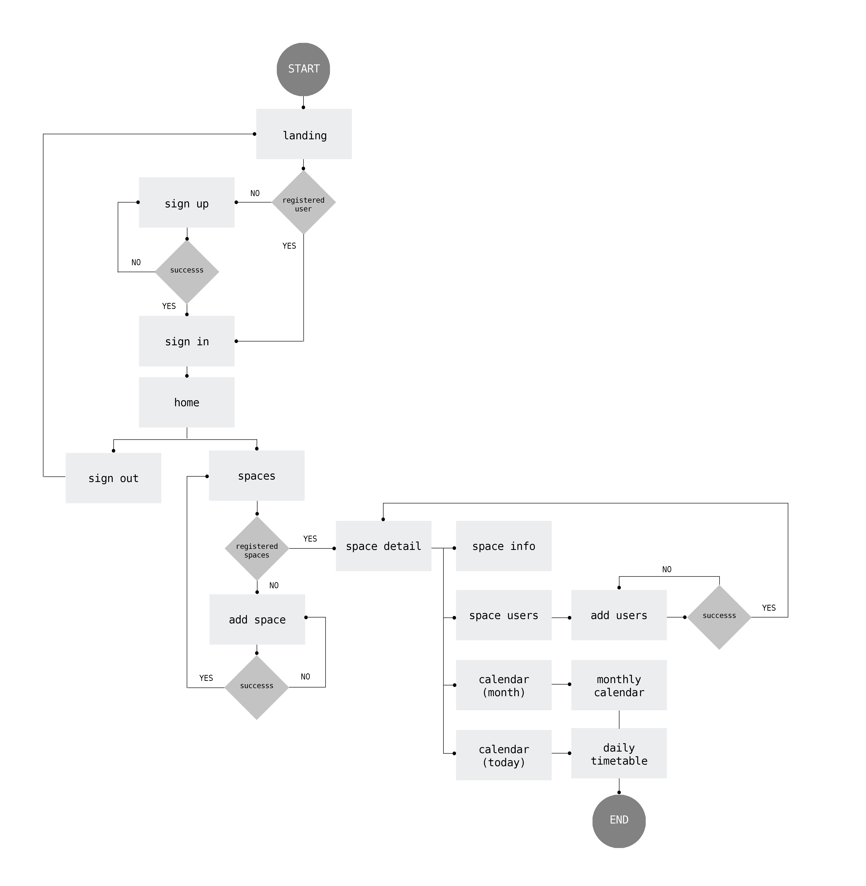
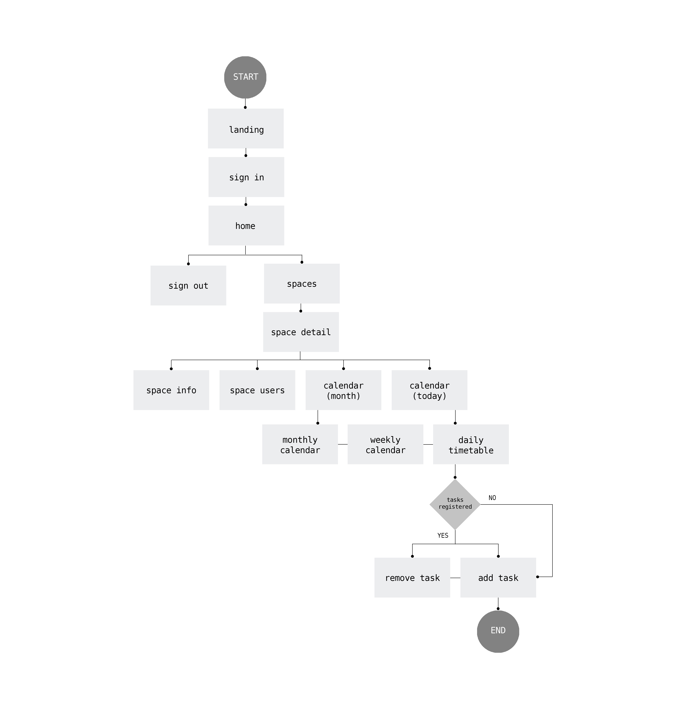
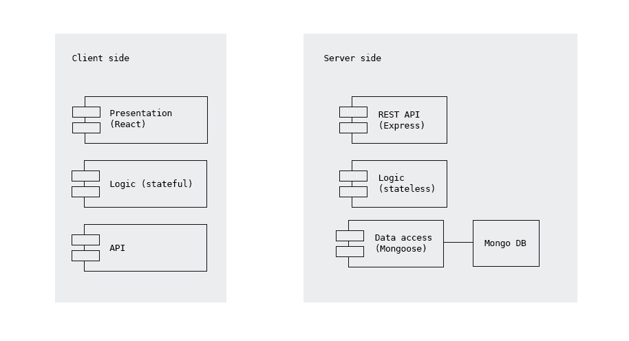
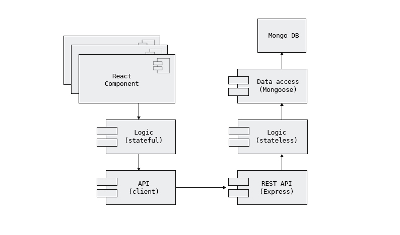
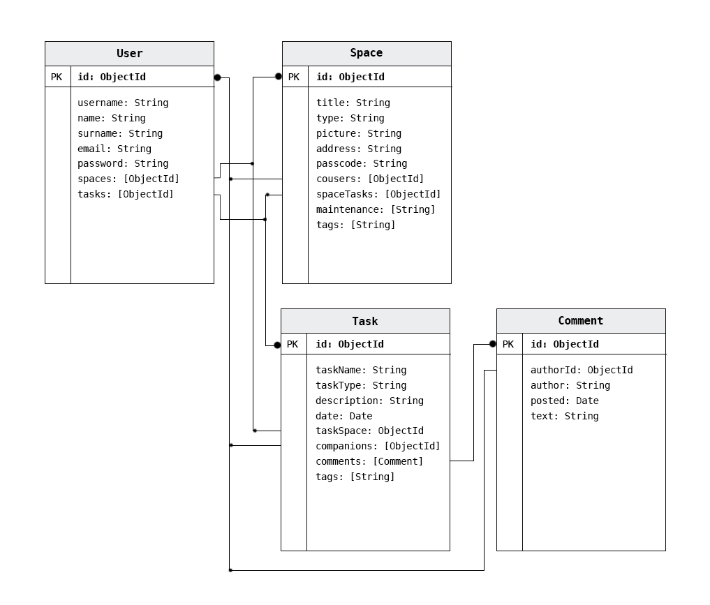
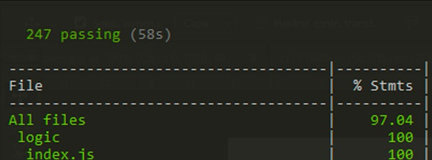

# e-cohabitat
---

A project by:

- **Carolina Zhou Lin**

Developed at:

- **Skylab Coders Academy**

## Introduction
**e-cohabitat** is a project that stems from the will to create and improve communities by providing an e-platform for the management of shared spaces in collective housing. 

Why? Collective housing offers:
- centralization of equipment and services, which ends up providing a greater economic efficiency and lower environmenal impact.
- lower ownership costs, which facilitates the access to a decent living space.
- coexistence and cooperation among residents, promoting better social values.

## Functional description
The application becomes a private network that connects all the users of a real-life physical shared space.

Users, once registered and logged in, will be able to:
- Create a functional panel/module for each shared space.
- Add other users to the space-module created and be added to others created by other users.
- Access the calendar-timetable of said spaces, consult the general and particular activities and add their own tasks to it.
- [_work in progress_] Leave daily comments according to what has been experienced in a particular shared space. 
- [_work in progress_] Control periodic activities such as cleaning or re-stocking by facilitating the assignation of tasks and turns amongst users, and providing a history of said activities.

### Use cases

### Flow charts

## Technical description
### Blocks

### Components

### Data model

## Code coverage

## "Mea culpa"
- Edit and delete spaces.
- Set periodic tasks.
- Create tags for tasks.
- View history of specific tasks (to facilitate the space maintenance).
- Post and delete comments.
