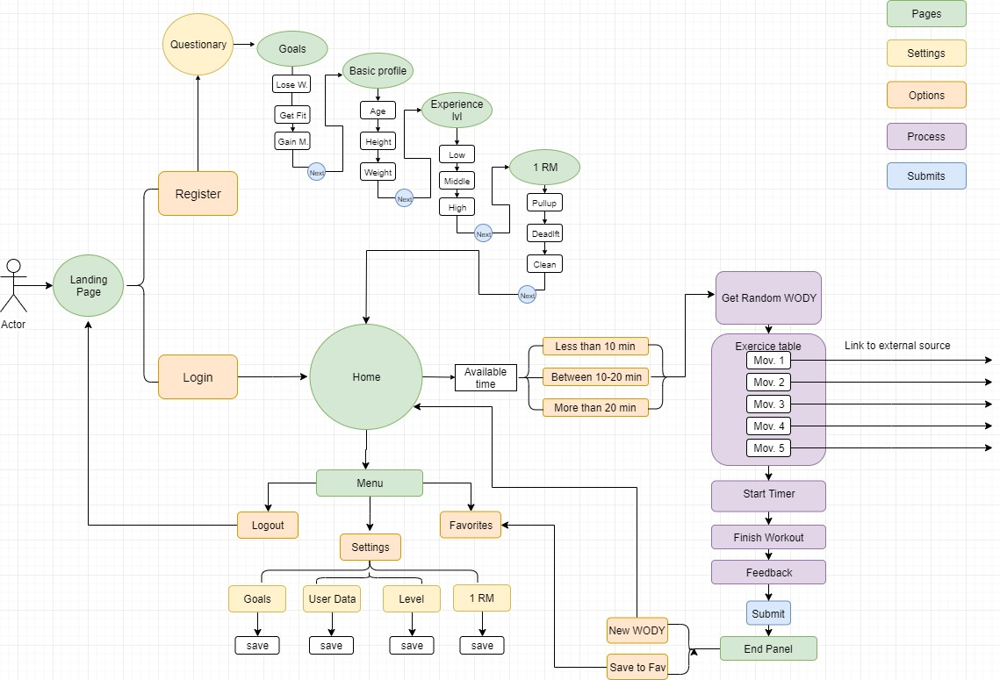
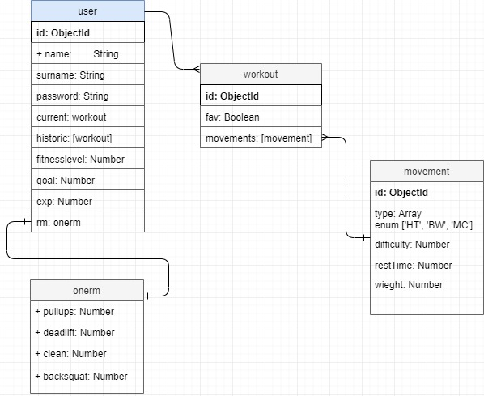

# WODY  fitness web-app 

## Porqué WODY ?

La idea de WODY surge de la necesidad de encontrar una solución un problema personal, la adaptación de los entrenamientos diarios o [WOD](https://openboxmagazine.com/que-es-un-wod-entrenamiento-del-dia/)'s a unos objetivos personales. Cuando uno se apunta a un Box o gimnasio de entrenamiento funcional, los entrenamientos diarios se diseñan para un grupo de personas con el objetivo de pasarlo bien, desahogarse y ponerse en forma. Cuando el objetivo va más allá, como ganar más masa muscular. Esos entrenamientos generalizados se quedan cortos. Aqui es donde WODY nos ayudarà.

WODY se basa en el beneficio de la aleatoriedad de los ejercicios mediante la metodologia [HIIT](https://es.wikipedia.org/wiki/Entrenamiento_de_intervalos_de_alta_intensidad) (High Intensive Interval Training). Los días que el usuario quiera entrenar, WODY generará una tabla de entrenamiento aleatoria, con no más de seis movimientos. Esta tabla tendrá en cuenta los entrenamientos de la última sesión del usuario para no repetirlos almenos en las próximas 48 horas. De esta forma WODY se asegura que tus músculos tengan tiempo de recuperarse. 

### Planning
Encontrarás el plannig para este proyecto en el siguiente [Trello](https://trello.com/b/uqdv1Gk0/wody-app)

## Cómo funciona WODY?

### Descripción funcional

La primera vez que el usuario se registra, WODY querrá conocerle mejor. El usuario pasará por un breve pero importante questionario que sirve para recojer los parámetros que haran posible que el entrenamiento se adapte al usuario.

Estos parámetros son:

- Peso, altura, edad:  Con ellos creamos un perfil básico del usuario.
- Nivel de experiencia: 

        El nivel se divide en Bajo, Medio y Alto. 
    Esto nos ayudara a adaptar los movimientos al nivel del usuario. Por ejemplo:

    A un usuario de nivel Bajo no le saldran nunca movimientos que requieran mucha experiencia, como un [muscle-up](https://youtu.be/1fQdBZfIuIY) o un [snatch](https://youtu.be/UBc5N_-xdqo). Los movimientos de experiencia Media como los pull-ups estaran adaptados, en este caso, al usuario le saldrian pullups con goma elástica. 

- 1 RM: El usuario de nivel medio o alto tendrá la opción de introducir sus 1 RM (una repetición máxima) para calcular los porcentajes usados en sus pesos.

Una vez realizado el questionario, el usuario accederá al panel de Home donde tendrá la opción de escojer el tiempo que tiene a su disposición en ese instante. Esto hará que WODY configure la tabla de ejercicios en consequéncia. Después, es el usuario quien desidirá cuando empezar con el entreno.

### Esquema de uso

### Esquema de datos

