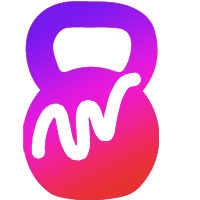
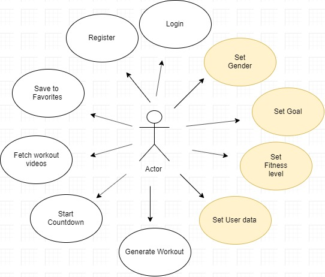
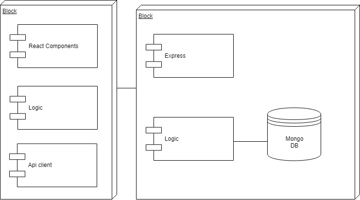
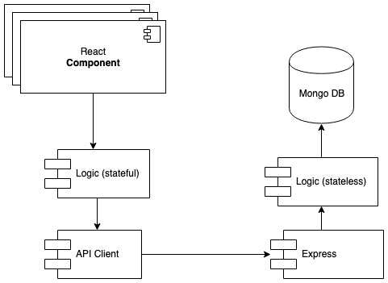
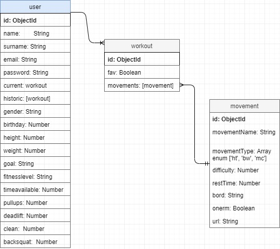
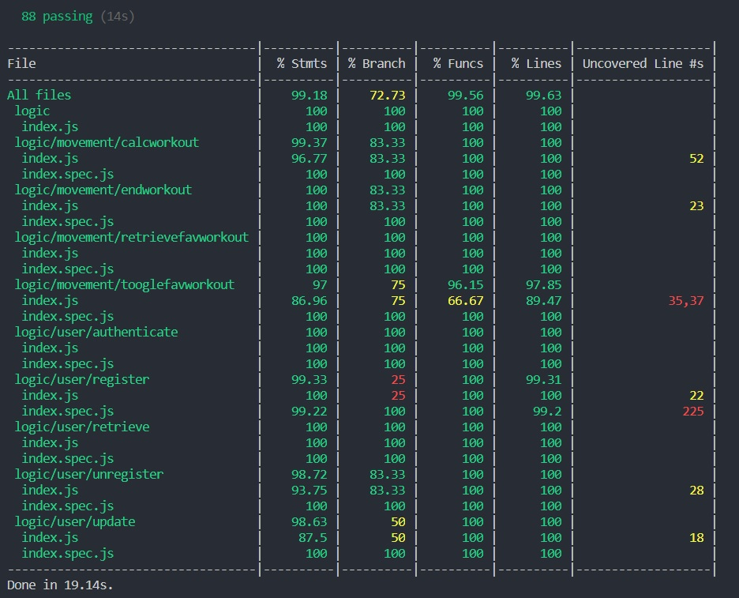

# WODY  fitness web-app 

## Why WODY?

The idea of ​​WODY arises from the need to find a solution to a personal problem, the adaptation of daily workouts or [WOD](https://openboxmagazine.com/que-es-un-wod-entrenamiento-del-dia/)'s to personal goals. When you sign up for a functional training Box or gym, daily workouts are designed for a group of people with the goal of having a good time, letting off steam and getting fit. When the goal goes further, how to gain more muscle mass. Those generalized workouts fall short. This is where WODY will help us.

WODY is based on the benefit of the randomness of the exercises through the [HIIT](https://es.wikipedia.org/wiki/Entrenamiento_de_intervalos_de_alta_intensidad) (High Intensive Interval Training) methodology. On the days that the user wants to train, WODY will generate a random training table, with no more than six movements. This table will take into account the training of the last session of the user so as not to repeat them at least in the next 48 hours. In this way WODY ensures that your muscles have time to recover.

## Planning

You will find the plannig for this project in the following [Trello](https://trello.com/b/uqdv1Gk0/wody-app)

## How does WODY work?

### Functional description

The first time the user registers, WODY will want to know you better. The user will go through a brief but important questionnaire that serves to collect the parameters that will make it possible for the training to adapt to the user.

These parameters are:

Weight, height, age: With them we create a basic user profile.

Level of Experience:

  The level is divided into Low, Medium and High.
This will help us adapt the movements to the user's level. For example:

A low level user will never have movements that require a lot of experience, such as a [muscle-up](https://youtu.be/1fQdBZfIuIY) or a [snatch](https://youtu.be/UBc5N_-xdqo). Media experience movements such as pull-ups will be adapted, in this case, the user would get pullups with elastic rubber.

1 RM: The user of medium or high level will have the option of entering their 1 RM (a maximum repetition) to calculate the percentages used in their weights.

Once the questionnaire is completed, the user will access the Home panel where he will have the option to choose the time available to him at that moment. This will cause WODY to configure the exercise chart accordingly. Then, it is the user who will decide when to start training.

### User Case

### Flow charts

## Technical Description 

### Blocks

### Components

### Data model

### Code Coverage

### Technologies

Javascript, ReactJS, Node.js, Express, MongoDB & Mongoose.

### To do 
App testing