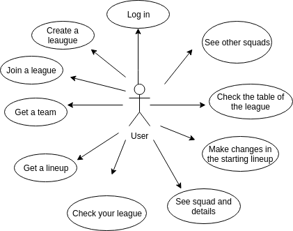
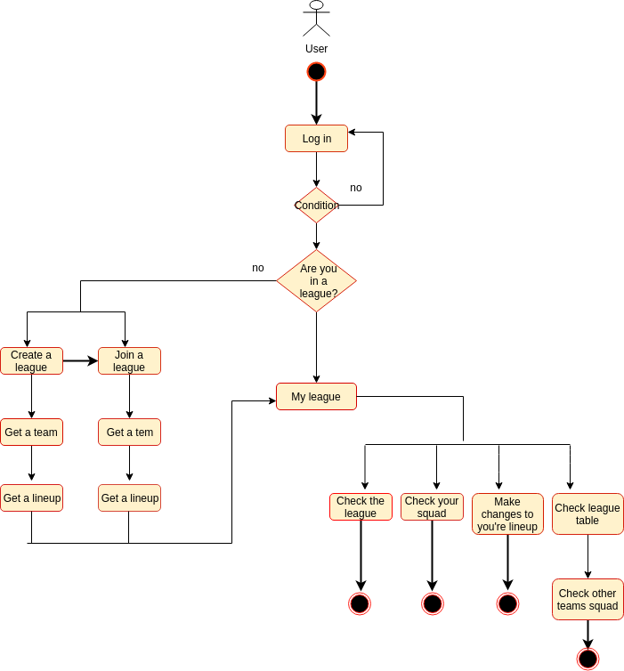
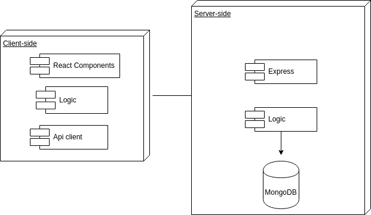
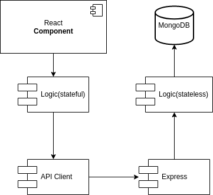
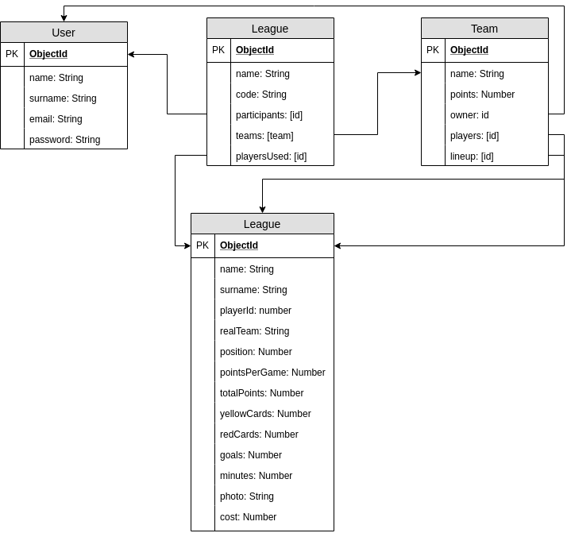
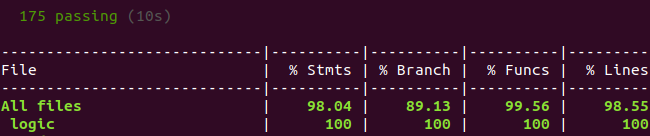
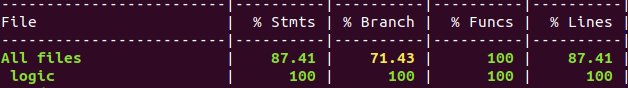

# Fantasy Football Footcamp

## Introduction

 

This is a football fantasy application with real players of the Premier League.

In this app you will join to a league and get a random team with 18 players and you will compite with your friends and others to be the best of all. 

The options available to you will be change your start line up and see your team's evolution in the general table of your league.

## Functional description

You can only use this app if you have an account and you are logged. 

* Once you're logged, the first time you login you could create a league or join an existent.

* After that you get a 18 player team divided by positions. 

* Also you get a static lineup of 11 players selected from you're 18 players.

* After that you land in the inner home page app. There you could see different options: 

- The info of your league
- Your players and their info. 
- The lineup and make changes by position
- The table of your league 
- The players of the other teams of your league

### Use Cases

### Flowcharts

## Technical Description

### Blocks

### Components

### Data Model

### Code Coverage

#### 

#### 

#### TODO

Version 2.0

* The user can participate in several leagues at the time
* Be able to synchronize the leagues with real Premier league and update the table

Version 3.0
* Add sales market players inside every league

### Technologies
Javascript, ReactJS, Node.js, Express, MongoDB & Mongoose.
