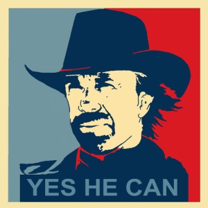
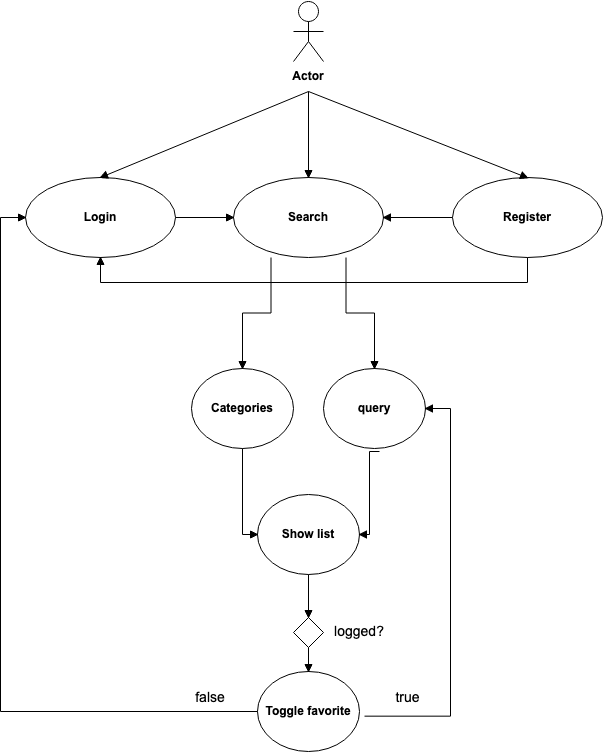
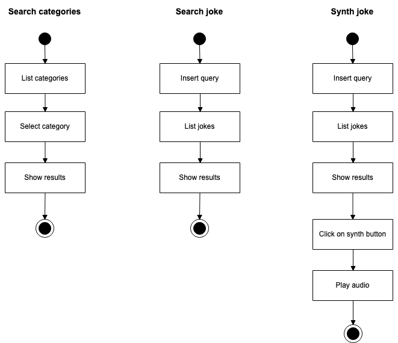
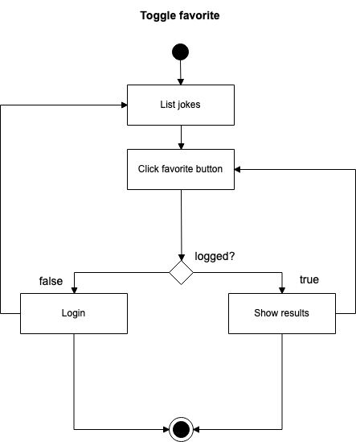
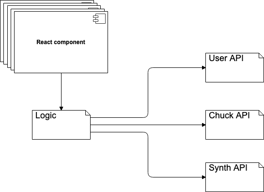
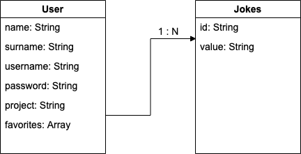

# Chuck Generator

## Description

Chuck Generator is a team project developed for [SkylabCoders](https://www.skylabcoders.com) bootcamp, as the endpoint of frontend part. Chuck Generator have been designed as a SPA that provides data (jokes) from an API about Chuck Norris, managing data user for login session and favorites storing (register, authentication, retireve and update).
Jokes can be shown by categories or by free search and each one can be reproduced via API and stored as favorite in user data object, being necessary to be logged in order to save it. API's connections have been managed using Promises.

## Functional description
### User case

## Technical description
### Technologies
* HTML
* Css - Sass
* Javascript
* React

### Activity diagram

### Blocks

### Components

### Data model

