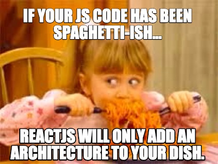
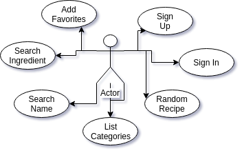
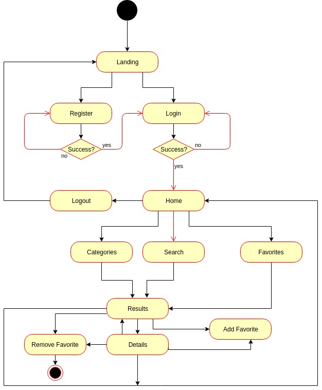
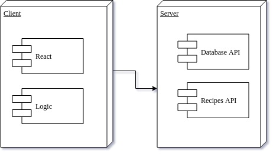
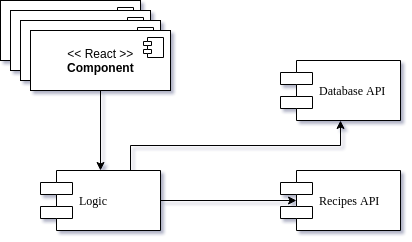
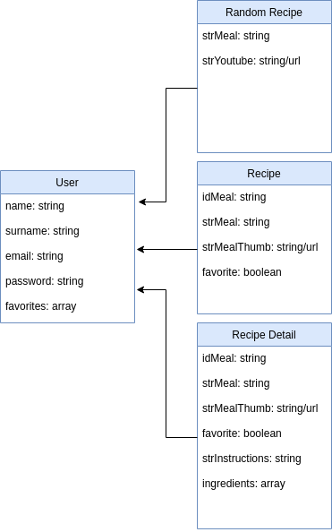

# Overcooked
    A new way to enjoy cooking 

## Introduction
    Overcooked serves not only as an excellent way to find delicious, healthy and original recipes, but also as a mean to test the skills we've acquired so far in the bootcamp regarding the use of front-end web development technologies such as React, JS6, SASS and API querying.

    As an extra, due to extensive testing and out of pure necessity, we've gained a deeper knowledge on the use of Git and GitHub.

    On load, Overcooked gives the visitor the chance to become a registered user and enjoy the full array of features it offers. Shall they choose to remain a guest, they will be presented with a random video for one of the hundreds of recipes the API database holds.
    
    Once registered and logged in, the member will receieve a list of categories from which to browse the archive in search for the meals that better suit their apetites for the day. Vegan or vegetarian? No worries, we got you covered!
    
    For those who wish to keep track of their most precious finds, the possibility to store them in a favorites list is also available.

    Ability to specify ingredients or recipe names is offered as an option in the searches, so even the most demading users are guaranteed to find whatever they're looking for.

    Anna
    Adriá
    Jorge G
    Querecuto (spiritual guidance)
    Alicia (general enlightenment)
    Rubber pig (playmate in dead moments)

    PD: if there is any error in the this amazing App you could always call for Manus help.

## Functional Description

### Use Cases

### Flows

## Technical Description

### Blocks

### Components

### Data Model

