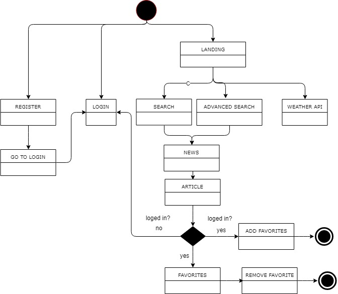
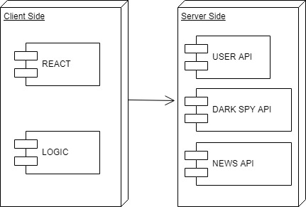
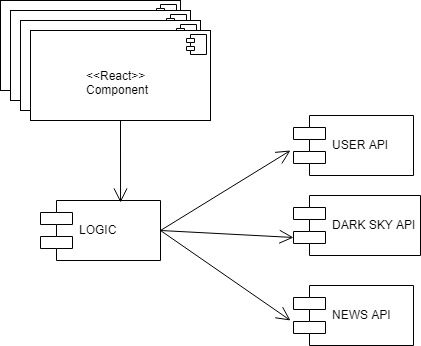
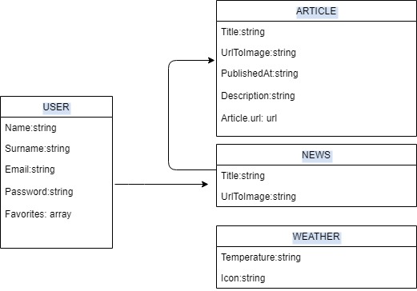

# SKYNEWS

## INTRODUCTION
The following app is a news search application which enables you to search  news based on 2 different selectors Category and Country.
There is another option to search news based on words.

The news can be clicked allowing you to access more details from the article itself.

After registration a user can log in and apart from searching news it can save the favorite news.
The favorite news can also be removed.

From the beggining the app shows the current weather conditions and they change based on searching news from other countries.

This project has been developed with REACT and the layout website has been done with SASS.

### _FUNCTIONAL DESCRIPTION_
**USE CASES**

**FLOW DIAGRAM**

**BLOCK DIAGRAM**

**COMPONENTS**

**DATA MODEL**

### CODE COVERAGE

