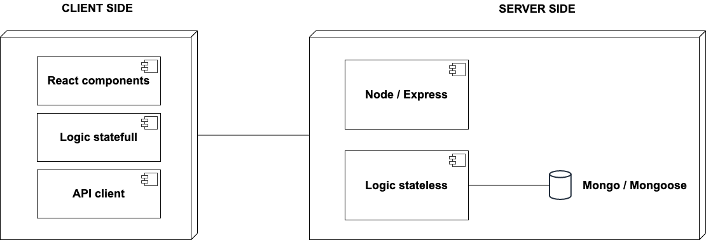

# SAM (Summer Activity Manager)

## [Demo: sam-app.surge.sh](http://sam-app.surge.sh/#/) 

## Planification 
You can follow project planification in this [trello board](https://trello.com/b/ZPLJAILD/personal)
## Abstract
**SAM** *(Summer Activity Manager)* is a tech solution for data management related to the administration of school summer activities. This kind of activities have exponetially grown for last year and in many cases data has been treated in a low professsional profile way. The purpose of this project is to stablish a consistent database model and a more optimized recovery mechanism of data.

## Functional description
Tutors can:
* register themselves as tutors
* register students (linked to his/her profile)
* update registered students
* register an enrollment (linked to a student and to the current year)
* check enrollment info (linked to a single student)

### Flow

### User cases

## Technical description
### Blocks

### Components

### React components

## Data model
### ER model

### Data schemas

## Technologies
Javascript, ReactJS, Node.js, Express, MongoDB & Mongoose.

## TODO
* React testing (50% complete)