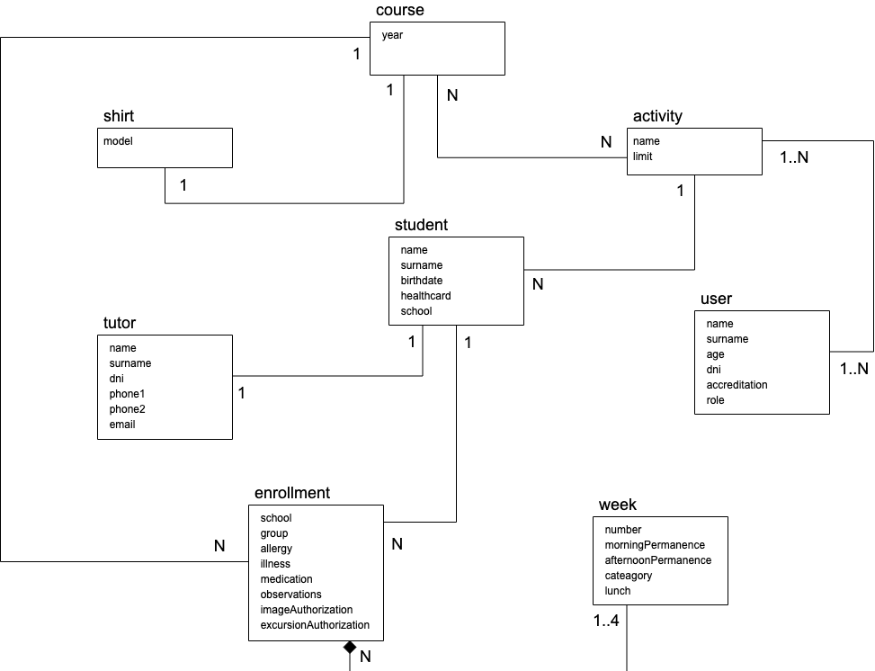
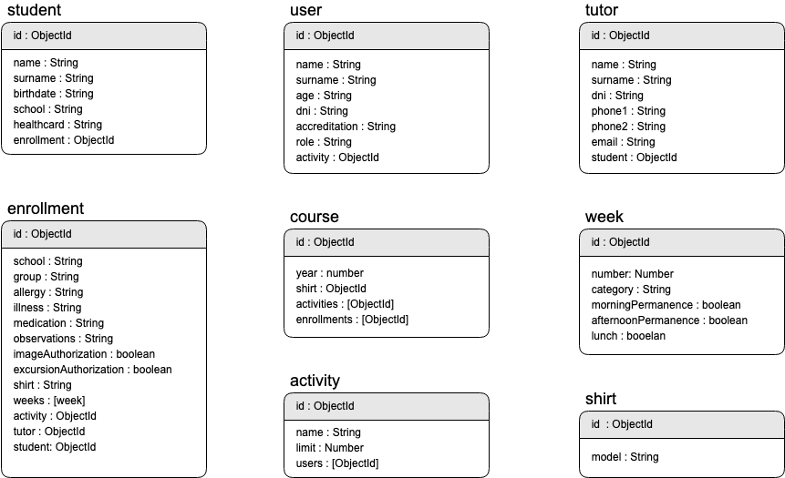

# SAM (Summer Activity Manager)

## Abstract
**SAM** *(Summer Activity Manager)* is a tech solution for data management related to the administration of school summer activities. This kind of activities have exponetially grown for last year and in many cases data has been treated in a low professsional profile way. The purpose of this project is to stablish a consistent database model and a more optimized recovery mechanism of data.

## Data model
### ER model

### Mongo schemas

