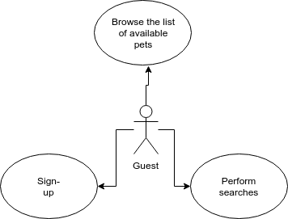
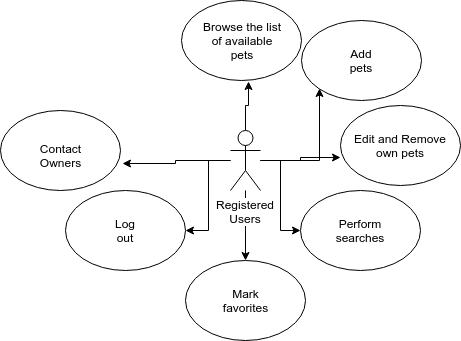
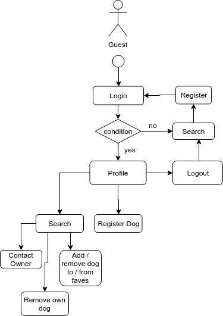
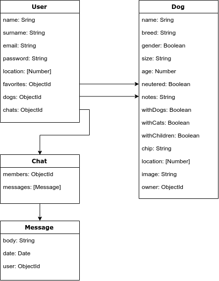
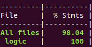

# WannaDOG

## Introduction

Create an app to help people who are looking for a dog to adopt connect with others who need to give theirs in adoption.

## Functional description

Guests can:

- Browse the list of available pets and read their descriptions.
- Perform custom searches.
- Sign-up to become a registered user.

Registered Users can:

- Browse the list of available pets and read their descriptions.
- Add and manage new pets to the list.
- Mark dogs as favorites to keep track of them.
- Contact the owners of the available pets and interact with them via live chat.

## Use cases

## Flowchart

## Data model

## Code Coverage

## Technologies

Javascript, ReactJS, Node.js, Express, MongoDB & Mongoose.
