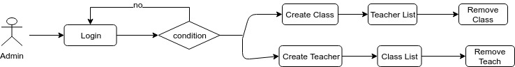
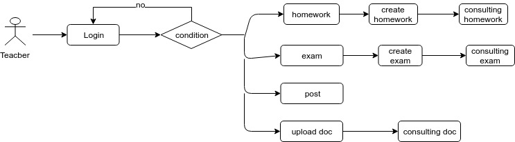
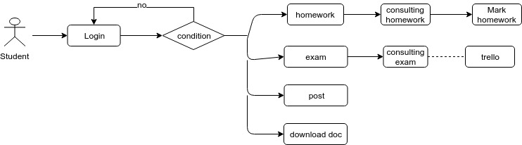
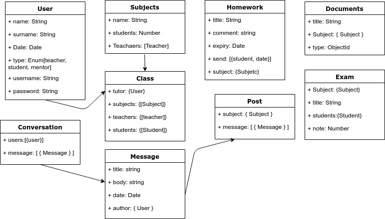

# Classty
## Introduction

Create a social network that connect students and teachers of the same educational center.

## Functional description

Mentors can:

- Create class
- Create Teachers
- Create Subject
- Remove the previous one and students

Teachers recieve for email the credentials for access its users.

Teachers can:

- Register student for its class
- Create homeworks
- Create exams
- Create Groups of works
- Add documentation
- Add post in the subject profile

Students can:
- Add post in the subject profile
- Move its homeworks to kanban
- Asigns itselves to group of workd
- Consult its notes and dates of exams

Teachers and Students can send messages among themselves

## Flowcharts
### Admin

### Teacher

### Student

## Technical Description

### Blocks

### Data Model

## Planing
[Trello](https://trello.com/b/FvQn0fqt/classty)