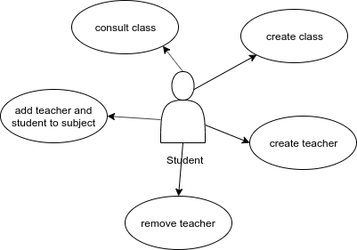
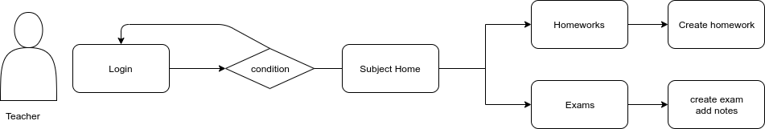

# Classty
## Introduction

Create a social network that connect students and teachers of the same educational center.

## Functional description

Mentors can:

- Create class
- Create Teachers
- Create Subject
- Remove the previous one and students

Teachers recieve for email the credentials for access its users.

Mentor can:

- Register student for subjects
- Register teacher for subjects
- Remove teacher
- Add teachers and student to subject

Teachers can:

- Create homeworks
- Create exams
- Add note in exam
- Check performed homework 
- Add message in the subject profile

Students can:
- Add message in the subject profile
- Move its homeworks to kanban
- Consult its notes and dates of exams

## Use cases
### Mentor

### Teacher

### Mentor

## Flowcharts
### Mentor

### Teacher

### Student

## Technical Description

### Blocks

### Data Model

### API coverage

## Planing
[Trello](https://trello.com/b/FvQn0fqt/classty)