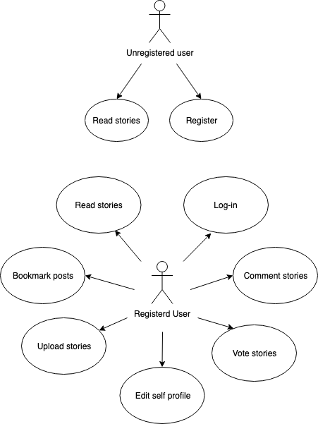
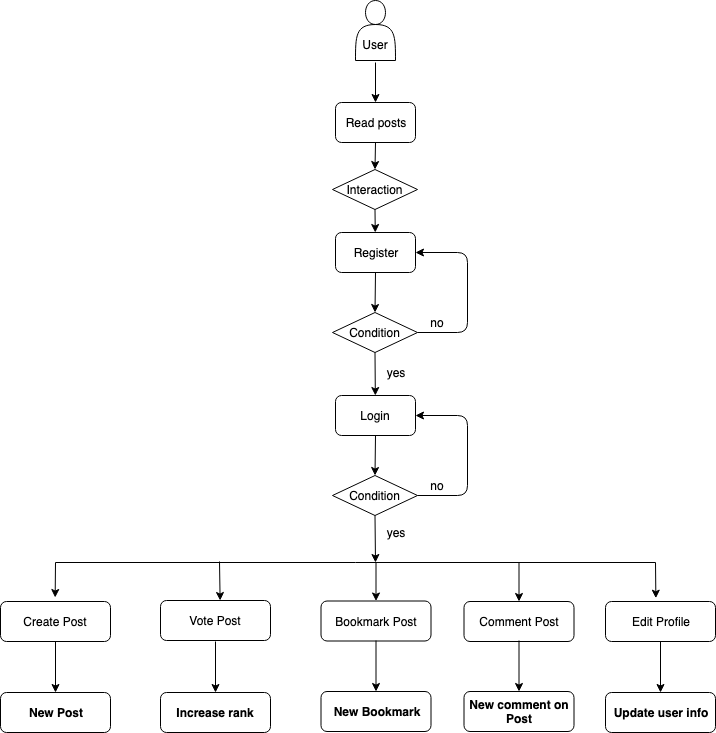
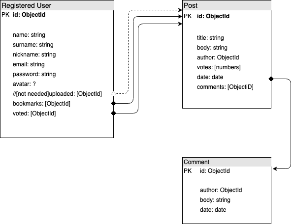

# Vltra

## Introduction

Vltra is an online short-stories magazine which aims to encourage writers to write and share their stories.

Anyone is able to read stories on Vltra, but only registered users can post, vote, bookmark and comment posts.

Stories are defautl sorted from new to old, so users can see the newest stories every time they enter Vltra. Besides, there's a easy-access ranking with the most voted stories.

## Planning
You can see Vltra's project status here:
[Vltra's Trello board](https://trello.com/b/EJmGr6bH/vltra-juampi)

## Functional description
Unregistered users can:
- Read stories.

Registered users can:
- Read stories.
- Upload stories.
- Bookmark favorite stories.
- Vote to improve stories ranking.
- Comment on stories.

At this point, Vltra help writers to easily share their short stories. Further development aims to improve Vltra's social features (i.e.: follow other users and get notifications on their activities).

### Use cases

### Flow chart

## Technical description
### Blocks
    /to do/
### Components
    /to do/
### React components
    /to do/
    
### Data model

### Technologies
Javascript, ReactJS, Node.js, Express, MongoDB & Mongoose.