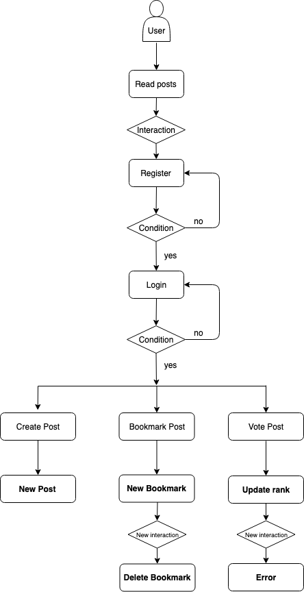
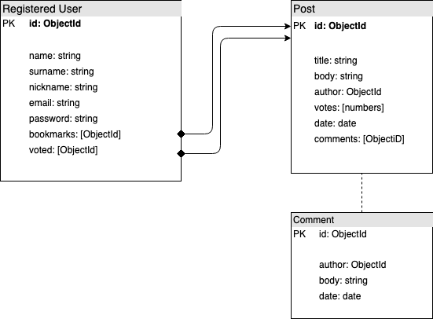

# Vltra

## Introduction

Vltra is an online short-stories magazine which aims to encourage writers to write and share their stories. It focuses on short stories, so each post can't be longer than 2000 chars.

Anyone is able to read stories on Vltra, but only registered users can post, vote and bookmark posts.

Stories are sorted from new to old by default, so users can see the newest stories every time they enter Vltra. Besides, there's a easy-access ranking with stories sorted by average ranking.

## Planning
You can see Vltra's project status here:
[Vltra's Trello board](https://trello.com/b/EJmGr6bH/vltra-juampi)

## Functional description
Unregistered users can:
- Read stories sorted by date (fresh first).
- Read stories by average rank.

Registered users can:
- Read stories.
- Upload stories.
- Bookmark favorite stories.
- Vote to update stories ranking.

At this point, Vltra help writers to easily share their short stories. Further development aims to improve Vltra's social features (i.e.: comment on posts, follow other users and get notifications on their activities).

### Use cases

### Flow chart

## Technical description
### Blocks

### Components

    
### Data model

### Code Coverage
#### api

#### app

Explanation: Jest has been experiencing some issues to show full test coverage.

### Technologies
Javascript, ReactJS, Node.js, Express, MongoDB & Mongoose.