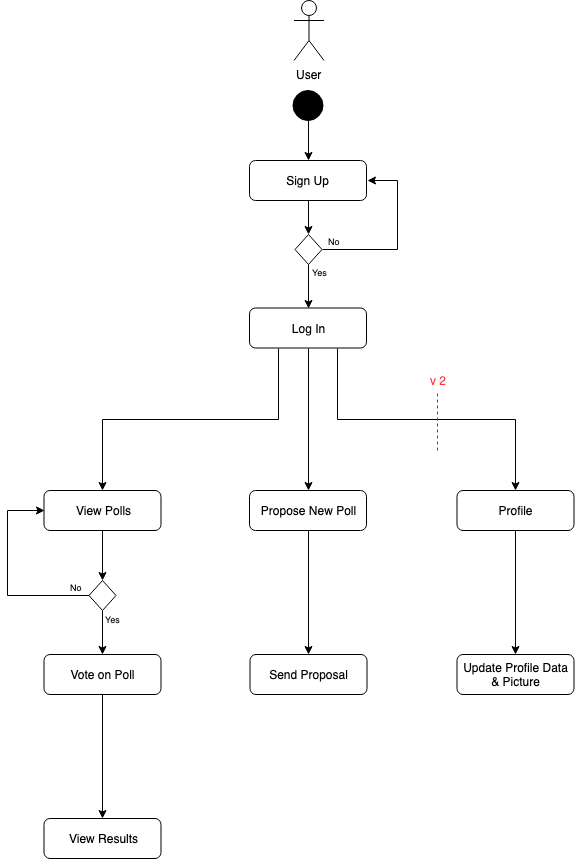
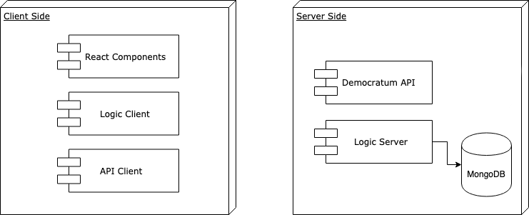
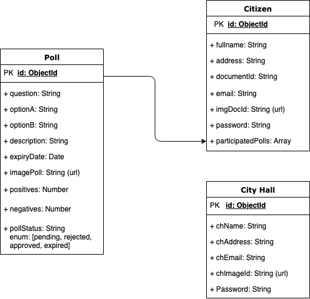

# DEMOCRATUM
A project by:

**Lluís Agustí Sanés @ Skylab Coders Academy**

## **Introduction**
Democratum is a MERN application that allows an afordable and scalable direct democracy voting system for municipalities to improve local governance quality and transparency.

## Functional description

Citizens can:

* View open polls.
* Vote on open polls.
* View past polls.
* Propose a new poll (city hall will evaluate and publish the poll).
* Edit and update their profile. Email and ID are not updateable.
* Result of participated polls once polls are finished. ---> (count++)
* Individual poll opinions are not saved. Logic check if the user has already participated on the poll. Then allows to vote, counts++ the vote and pushes the poll ID to the user account.

City Halls can:

* Log In.
* Create polls.
* Edit and update their profile.
* Edit and approve polls proposed by citizens.
* Retrieve citizen's info: name, address, ID, email and participated polls.

Super Admin (me):

* Create City Halls.
* List of City Halls.
* Retrieve City Hall info: city name, address, documentation files and email.

City Halls or their representatives should contact Democratum and, after check the documentation that accredits them as a public authority they will recieve an email letting them know that they have been signed up.

## **Functional Description**

### Use cases

### Flows

## **Technical Description**

### Blocks

### Data Model

### Code Coverage
Non