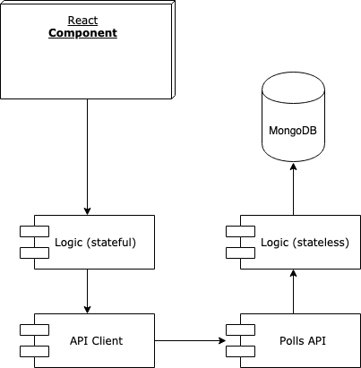

# DEMOCRATUM
A project by:

**Lluís Agustí Sanés @ Skylab Coders Academy**

## **Introduction**
Democratum is a MERN single page application that allows an affordable and scalable direct democracy voting system for municipalities to improve governance quality and transparency.

# **Functional Description**

Citizens can:

* Sign up and log in.
* View available polls.
* Vote once on available polls.
* View current results of already voted polls.
* Propose a new poll (poll will take the status pending).

Admins (city halls) can:

* Log In.
* Create polls.
* Approve or reject polls proposed by citizens.

Super Admins can:

* Create City Halls.

City Halls or their representatives should contact Democratum and, after check the documentation that accredits them as a public authority, they will recieve an email letting them know that they have been signed up.

# **Functional Description**

## Use cases

## Flows

# **Technical Description**

## Blocks

## Components

## Code Coverage

 

## Technologies
Javascript, ReactJS, Node.js, Express, MongoDB & Mongoose.

## TODO

* Citizen: profile, update and picture upload.
* Admin: retrieve citizens profiles.
* Poll creation: upload image at Cloudinary.