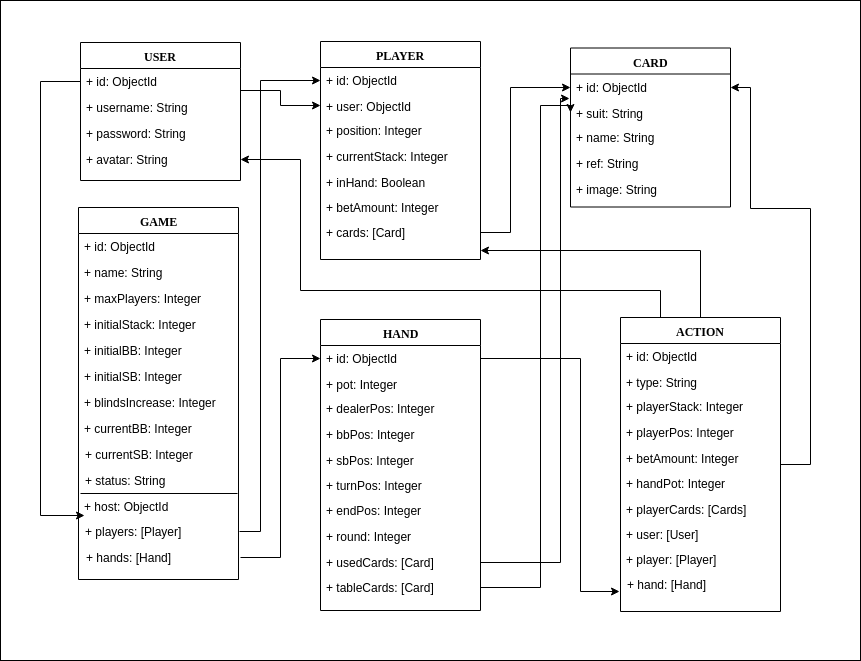

# Bro Holdem

# [Bro Holdem TRELLO](https://trello.com/b/C3Vl4JBa/bro-holdem) 

## Introduction
Bro Holdem is a platform that allows users to host and join real-time online poker games. 

It aims to provide a more convenient way to play poker without all the hustle of face-to-face games, such as: card dealing, turn time or chips arrangement.

## Functional description

[Wireframes](images/functional-description)

Registered users can:

* Host a game and set up game rules.
* Join a game with a token.
* Start game when table is ready.
* Check, call, raise or fold cards in each round.
* Leave game.

### Use Cases

### Flowcharts
#### Host
#### Player
#### Guest

## Technical Description

### Blocks
*TODO*
### Components
*TODO*
### React Components
*TODO*
### Data Model

*TODO*
### Code Coverage
*TODO*
### Technologies
*TODO*

