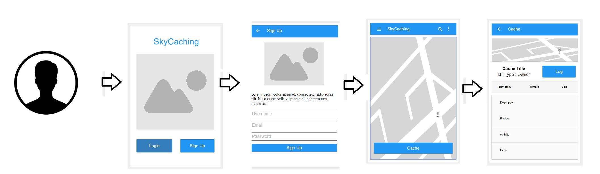
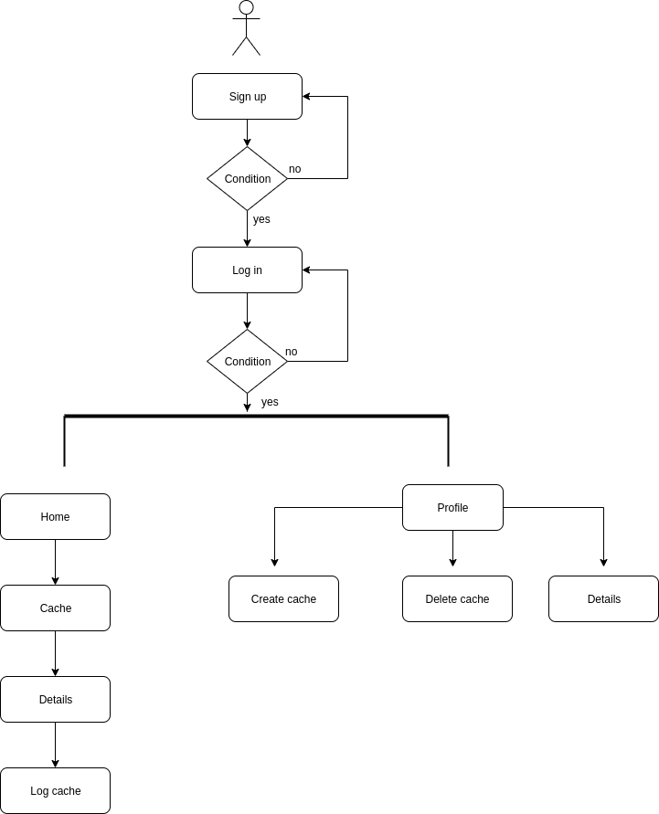
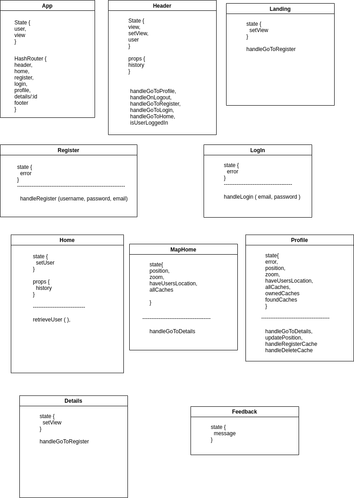
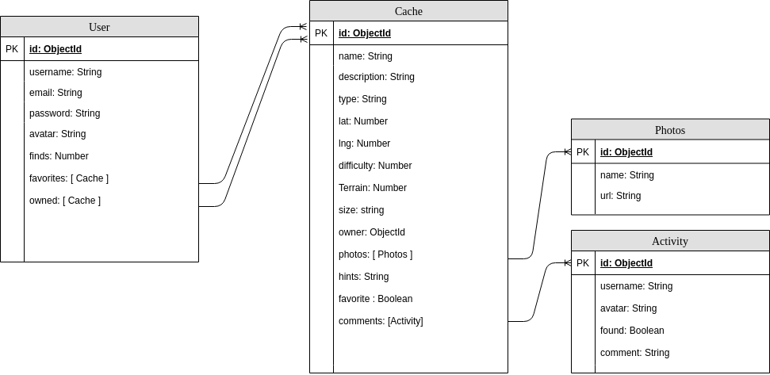
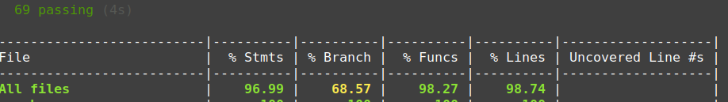

# SkyCaching

Go outside! Enjoy discovery, exploration and adventure in the real-world. 

Hide and seek caches all over the world using the latest GPS and real time positioning technologies right from your mobile device.

A demo is available on [surge](https://skycaching.surge.sh).

## Functional Description

- Users can create new caches on real-world locations and log caches from other users when found.

- Users are geo-localized in real-time to be able to find the caches.

### Use cases

### Flowchart

## Technical Description

### Blocks

### React Components

### Data Model

## Coverage API 

## Technologies

Javascript, ReactJS, Node.js, Express, Leaflet, MongoDB & Mongoose.

## TODO

- Output sanization

- Filter chaches by owned, found and more.

- Upload cache pictures

- Favorite caches

## Planning
[Trello](https://trello.com/b/ZlBTnNf9/skycaching-nestor) 

