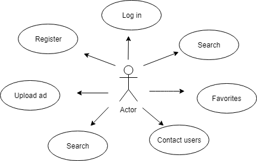
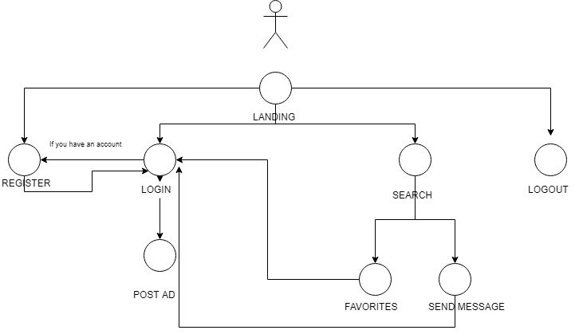
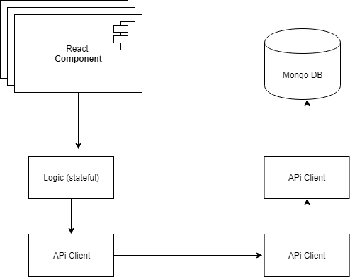
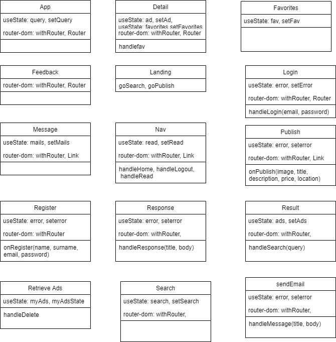
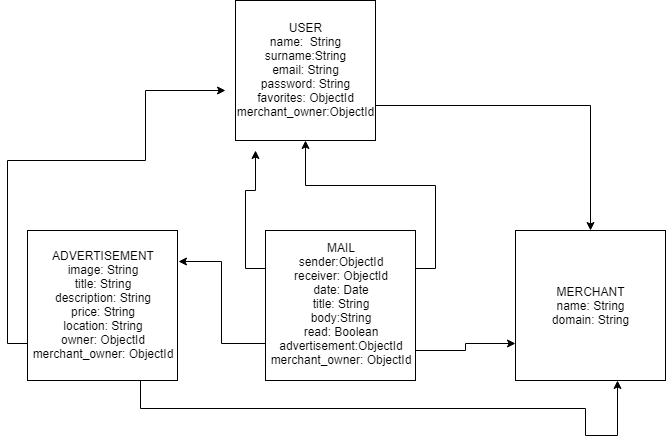
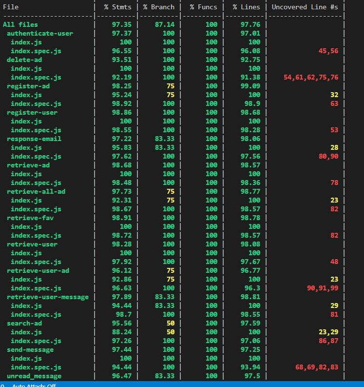
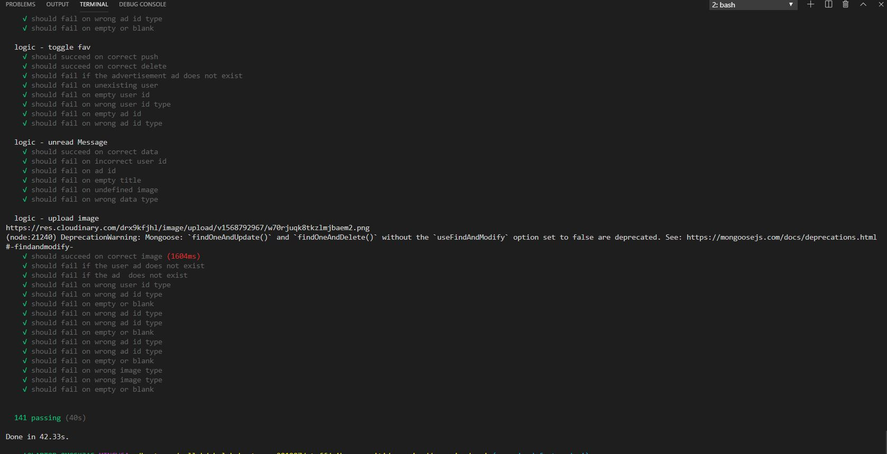

# Nombre Proyecto

## Introduction

This an advertisement website application. Due to all the websites related with this matter have the same structure, this application is going to offer a general behaviour. The backend can work with many frontend. This one could be modified by the companies, in order to have a different wetsite.

##Planification

https://trello.com/b/L6NT6grj/myproject

## Functional description

Companies can:
- Change some details from frontend, like: background, letter, logo, and personal information
- Have user and items in our server

Users can: 
- Have an account in our page. 
- Look for different products.
- Upload ad in the website.
- Contact with other users.

### Use case

###Flowcharts

## Technical description

### Blocks

### Components

### React Components

### Data Model

### Code Coverage

