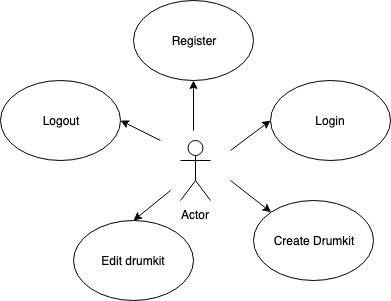
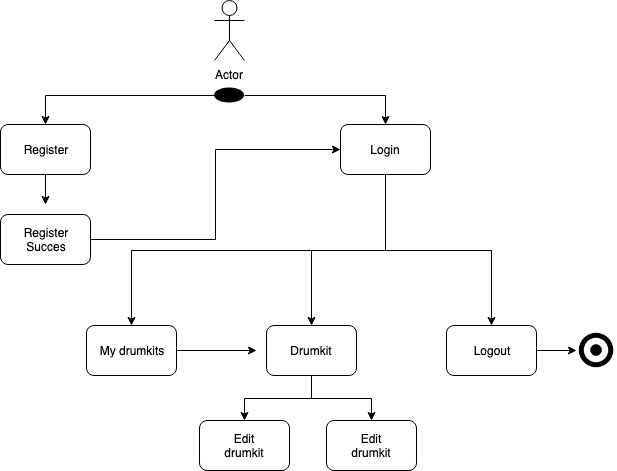
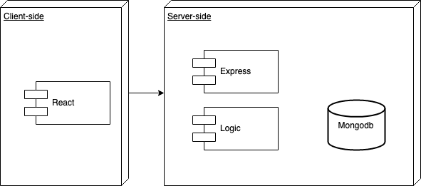
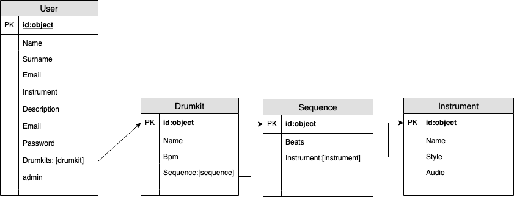

# Goliath

## Introduction

Goliath is an application that aims to help musicians to generate drumtracks easily, to save and edit them. As well as being able to choose your preferred sound.

## Functional description

Users can:

- Registser themselves as Goliath users
- Create their own drumkits (jamtracks)
- Edit their own drumkits (jamtracks)

## Use cases

## Flowcharts

## Technical description

### Blocks

## Data model

## Technologies

Javascript, ReactJS, Node.js, Express, MongoDB & Mongoose.

## To do 

- output sanitization
- securization
- BEM 
